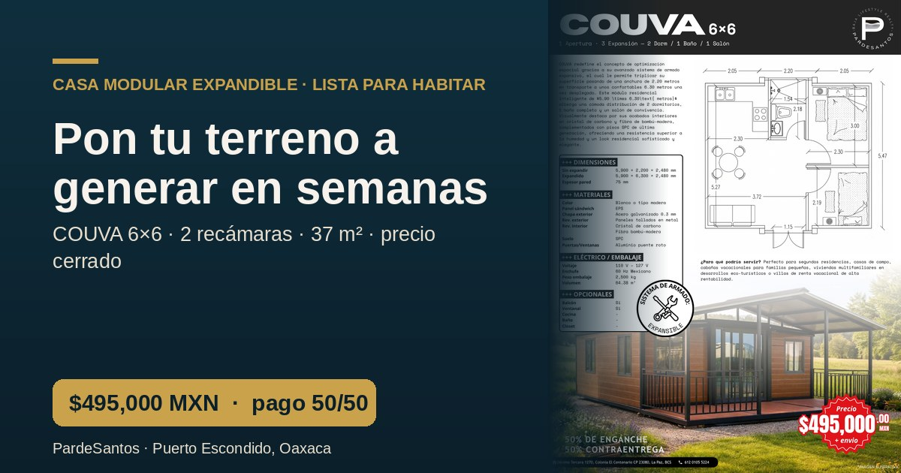
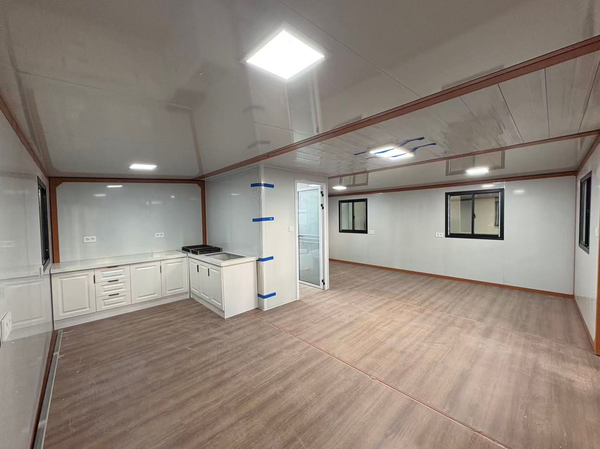
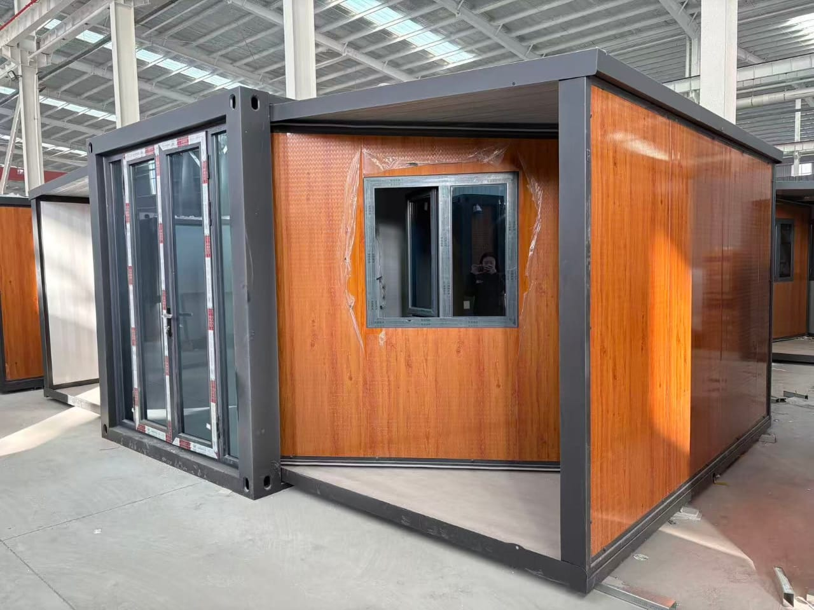

<p align="center">
  
</p>

<h1 align="center">COUVA 6×6 — Landing Premium (PardeSantos)</h1>

<p align="center">
  <strong>Landing page bilingüe (ES/EN) de alta conversión para vender la casa modular expansible COUVA 6×6, con captación de leads automatizada vía n8n + Supabase.</strong>
</p>

<p align="center">
  
  
  
  
  
</p>

<p align="center">
  
  
  
  
</p>

<p align="center">
  <a href="#-acerca-del-proyecto">Acerca</a> •
  <a href="#-características">Características</a> •
  <a href="#-arquitectura">Arquitectura</a> •
  <a href="#-comenzando">Comenzando</a> •
  <a href="#-flujo-de-captación">Captación</a> •
  <a href="#-seguridad--blindaje">Seguridad</a> •
  <a href="#-contacto">Contacto</a>
</p>

---

## 📖 Acerca del Proyecto

<p align="center">
  
</p>

**COUVA 6×6 Landing** es una página de aterrizaje pensada como **herramienta de venta**: recibe tráfico de redes sociales y lo convierte en citas y prospectos calificados para la casa modular expansible **COUVA 6×6** de **PardeSantos** (Puerto Escondido, Oaxaca — e instalable en cualquier terreno con acceso).

El copy está construido sobre un análisis real de mercado (FODA, ROI comparativo, guion de ventas) y aplica técnicas de **persuasión, cierre y SEO**, siempre en **"modo blindado"**: presenta las características como tales y el ROI como *estimación con disclaimer*, para proteger la campaña frente a PROFECO y a los rechazos de anuncios de Meta/Google.

### 🛠️ Construido Con

<p align="left">
  
  
  
  
</p>

---

## ✨ Características

| Característica | Descripción |
|---|---|
| 🌐 Bilingüe ES/EN | Rutas `/es` y `/en` con `hreflang`, un solo diccionario de contenido |
| ✍️ Copy persuasivo blindado | Dolor → solución → ROI → cierre, sin promesas que expongan la campaña |
| 📈 Calculadora de ROI | El visitante calcula el costo de tener su terreno parado (con disclaimer) |
| 🤝 Programa de referidos 7% | Sección + formulario para brokers, agentes, notarios y agentes municipales |
| 🔗 SEO + Open Graph | Imagen social 1200×630 por idioma, JSON-LD, sitemap y canonical |
| 💸 Pago con cripto | XRP, USDT, TRX, BTC y ETH, con precio anclado en MXN |
| 🛡️ Captación segura | Formularios → n8n → Supabase con RLS (los datos no se pueden leer públicamente) |
| 📲 Multicanal | Agenda (Google Calendar), WhatsApp, correo y formularios en una sola página |

---

## 🎬 Demo

<p align="center">
  
  &nbsp;&nbsp;
  
</p>

> ¿Quieres el demo en vivo? Despliega en segundos con Netlify/Vercel/Cloudflare Pages (ver [Comenzando](#-comenzando)).

---

## 🏗️ Arquitectura

```
Redes sociales (OG image + texto)
        │
        ▼
Landing Astro (ES/EN) ── estática, SEO, rápida
        │  formularios (lead + referidos)
        ▼
Webhook n8n  ── honeypot + validación
        │
        ├─► Supabase   (tablas leads / referidos, RLS insert-only)
        ├─► Google Sheets  (espejo en vivo)*
        ├─► Gmail / Telegram (alerta)*
        └─► Respuesta 200 al navegador
```
<sub>* La notificación es best-effort (`continueOnFail`): si un canal falla, el lead nunca se pierde.</sub>

### Estructura del proyecto

```
stellar-couva-landing/
├── public/
│   ├── media/            # Fotos y videos del producto
│   ├── og/               # Imágenes Open Graph (ES/EN)
│   ├── ficha-couva-6x6.pdf
│   ├── robots.txt · sitemap.xml · favicon.svg
├── src/
│   ├── i18n/content.ts   # Todo el copy bilingüe (una sola fuente)
│   ├── layouts/          # Base.astro (SEO/OG) · Legal.astro
│   ├── components/       # Landing.astro (todas las secciones)
│   └── pages/
│       ├── es/ · en/     # index + páginas legales por idioma
│       └── index.astro   # Redirección según idioma del navegador
├── n8n/
│   └── couva-lead-workflow.json   # Workflow exportado (importable)
└── .env.example
```

---

## 🚀 Comenzando

### Prerrequisitos

- [Node.js](https://nodejs.org) `>= 18`
- Una cuenta de [Supabase](https://supabase.com) (gratis) y una instancia de [n8n](https://n8n.io)

### Instalación

1. Clona el repositorio
   ```sh
   git clone https://github.com/oscaromargp/couva-landing.git
   cd couva-landing
   ```

2. Instala las dependencias
   ```sh
   npm install
   ```

3. Configura las variables de entorno
   ```sh
   cp .env.example .env
   # Edita .env con tu URL de sitio, webhook de n8n y link de agenda
   ```

4. Inicia en desarrollo
   ```sh
   npm run dev
   ```

5. Compila para producción
   ```sh
   npm run build   # genera /dist (estático)
   ```

### Despliegue (gratis)

Sube la carpeta `dist/` a **Netlify**, **Vercel** o **Cloudflare Pages**. Define la variable `PUBLIC_SITE_URL` con tu dominio final para que las imágenes Open Graph y el `sitemap` apunten correctamente.

---

## 🔗 Flujo de captación

1. **Base de datos** — Ejecuta las migraciones (o crea las tablas `leads` y `referidos`) en Supabase con RLS `insert-only`.
2. **Workflow n8n** — Importa `n8n/couva-lead-workflow.json`, conecta tu credencial de notificación y **activa** el workflow.
3. **Conecta la landing** — Pon la URL del webhook en `PUBLIC_N8N_WEBHOOK_URL`.

Los formularios envían: datos del prospecto, idioma, CTA de origen y parámetros **UTM** para medir tus campañas.

---

## 🛡️ Seguridad / Blindaje

| Riesgo | Mitigación |
|---|---|
| Fuga de datos personales | RLS en Supabase: `insert` público, `select` bloqueado |
| Spam de bots | Campo *honeypot* + validación en n8n |
| Rechazo de anuncios / PROFECO | Copy en "modo blindado", ROI como estimación con disclaimer |
| Cumplimiento legal (MX) | Aviso de Privacidad (LFPDPPP), Términos y Términos de Referidos |
| Secretos | `.env` fuera de git; el navegador nunca toca claves de servicio |

---

## 💖 Apoya este Proyecto

Si este proyecto te fue útil, considera hacer una contribución. Esto me ayuda a seguir creando herramientas de código abierto.

<p align="center">
  <strong>Donaciones en Criptomonedas — Red XRP</strong><br><br>
  
</p>

> Dirección XRP: `rBthUCndKy3Xbb19Ln4xkZeMwusX9NrYfj`

---

## 📄 Licencia

Proyecto privado / propietario. Todos los derechos reservados © PardeSantos.

---

## 📬 Contacto

<p align="center">
  <strong>Oscar Omar Gómez Peña</strong>
</p>

<p align="center">
  <a href="https://oscaromargp.github.io/Oscaromargp/">
    
  </a>
  &nbsp;
  <a href="https://github.com/oscaromargp">
    
  </a>
  &nbsp;
  <a href="mailto:oscaromargp@gmail.com">
    
  </a>
</p>

<p align="center">📞 6121077805</p>

---

## 🙏 Agradecimientos

<p align="center">
  <br/>
  <em>
    "Porque Dios es el que en vosotros produce<br/>
    así el querer como el hacer,<br/>
    por su buena voluntad."
  </em>
  <br/>
  <strong>— Filipenses 2:13</strong>
  <br/><br/>
  Todo lo que aquí existe nació primero como un deseo en el corazón.<br/>
  Cada proyecto, cada línea, cada idea que toma forma —<br/>
  es un regalo de Aquel que nos dio tanto el sueño como la fuerza de alcanzarlo.<br/>
  <strong>A Dios, toda la gloria.</strong>
  <br/>
</p>

---

- [Astro](https://astro.build) · [Tailwind CSS](https://tailwindcss.com) · [Supabase](https://supabase.com) · [n8n](https://n8n.io) — por el stack
- [Shields.io](https://shields.io) — por los badges
- [awesome-readme](https://github.com/matiassingers/awesome-readme) — por la inspiración
