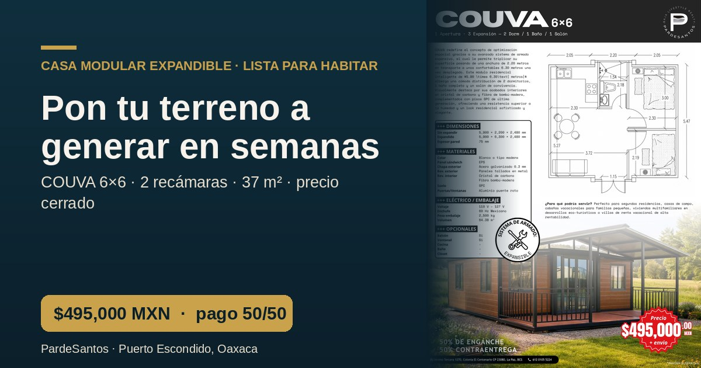
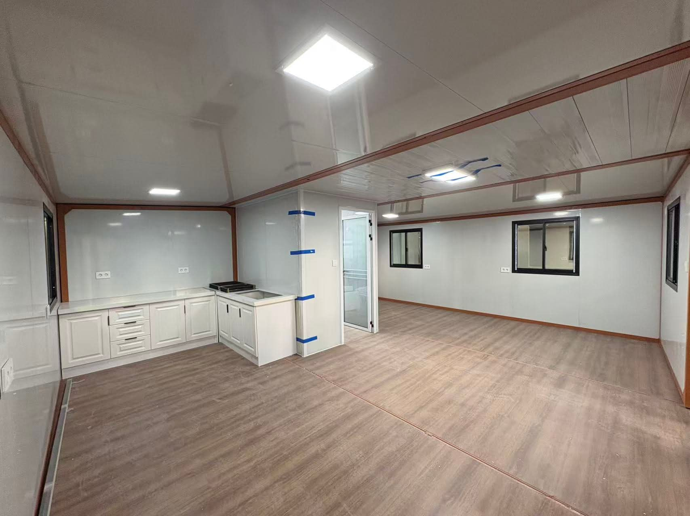
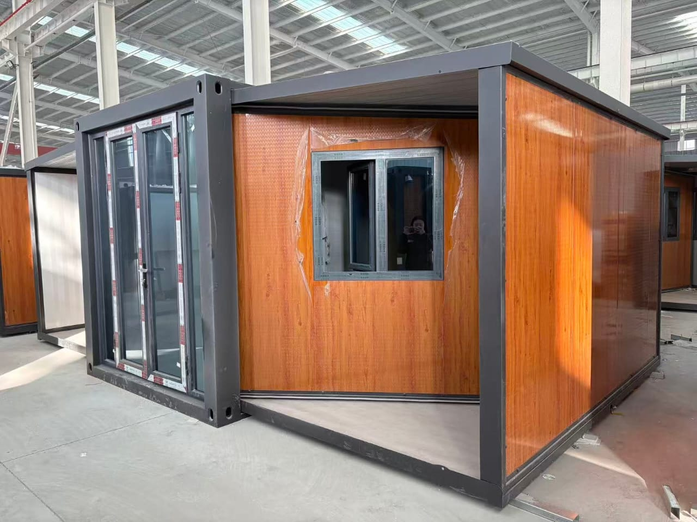

<p align="center">
  
</p>

<h1 align="center">COUVA 6×6 — Landing Premium (PardeSantos)</h1>

<p align="center">
  <strong>Landing page bilingüe (ES/EN) de alta conversión para vender la casa modular expansible COUVA 6×6, con chatbot de IA y captación de leads automatizada vía n8n + OpenRouter + Supabase.</strong>
</p>

<p align="center">
  
  
  
  
  
</p>

<p align="center">
  
  
  
  
</p>

<p align="center">
  <a href="#-acerca-del-proyecto">Acerca</a> •
  <a href="#-características">Características</a> •
  <a href="#-arquitectura">Arquitectura</a> •
  <a href="#-comenzando">Comenzando</a> •
  <a href="#-flujo-de-captación">Captación</a> •
  <a href="#-seguridad--blindaje">Seguridad</a> •
  <a href="#-contacto">Contacto</a>
</p>

---

## 📖 Acerca del Proyecto

<p align="center">
  
</p>

**COUVA 6×6 Landing** es una página de aterrizaje pensada como **herramienta de venta**: recibe tráfico de redes sociales y lo convierte en citas y prospectos calificados para la casa modular expansible **COUVA 6×6** de **PardeSantos** (Puerto Escondido, Oaxaca — e instalable en cualquier terreno con acceso).

El copy está construido sobre un análisis real de mercado (FODA, ROI comparativo, guion de ventas) y aplica técnicas de **persuasión, cierre y SEO**, siempre en **"modo blindado"**: presenta las características como tales y el ROI como *estimación con disclaimer*, para proteger la campaña frente a PROFECO y a los rechazos de anuncios de Meta/Google.

### 🛠️ Construido Con

<p align="left">
  
  
  
  
</p>

---

## ✨ Características

| Característica | Descripción |
|---|---|
| 🌐 Bilingüe ES/EN | Rutas `/es` y `/en` con `hreflang`, un solo diccionario de contenido |
| ✍️ Copy persuasivo blindado | Dolor → solución → ROI → cierre, sin promesas que expongan la campaña |
| 📈 Calculadora de ROI | El visitante calcula el costo de tener su terreno parado (con disclaimer) |
| 🤝 Programa de referidos 7% | Sección + formulario para brokers, agentes, notarios y agentes municipales |
| 🤖 Chatbot de IA | Widget flotante → n8n + **OpenRouter**: asesor comercial que responde precios/materiales/tiempos y captura al prospecto (con fallback offline a menú + WhatsApp) |
| 🔗 SEO + Open Graph | Imagen social 1200×630 por idioma, JSON-LD (Schema.org `Product`), sitemap y canonical |
| 💸 Pago con cripto | XRP, USDT, TRX, BTC y ETH, con precio anclado en MXN |
| 🛡️ Captación segura | Formularios → n8n → Supabase con RLS (los datos no se pueden leer públicamente) |
| 📲 Multicanal | Agenda (Google Calendar), WhatsApp, correo y formularios en una sola página |

---

## 🎬 Demo

<p align="center">
  
  &nbsp;&nbsp;
  
</p>

> **🔴 En vivo:** **https://couva.148-72-153-91.sslip.io** — desplegado en Coolify (VPS) detrás de Traefik con HTTPS automático (Let's Encrypt), gzip y cache de assets.
>
> ¿Quieres tu propia copia? Despliega en segundos con `deploy/deploy.sh` (ver [Despliegue](#-despliegue)) o con Netlify/Vercel/Cloudflare Pages.

---

## 🏗️ Arquitectura

```
Redes sociales (OG image + texto)
        │
        ▼
Landing Astro (ES/EN) ─ estática, SEO, servida por Nginx (gzip+cache) tras Traefik/Coolify
        │                                   │
        │ formularios (lead + referidos)    │ chat (mensajes del visitante)
        ▼                                   ▼
Webhook n8n /couva-lead            Webhook n8n /couva-chat
   honeypot + validación             AI Agent + memoria por sessionId
        │                                   │
        ├─► Supabase (leads/referidos,      ├─► OpenRouter (LLM) ─ system prompt "Asesor COUVA"
        │   RLS insert-only)                ├─► detecta datos de contacto → notifica lead
        ├─► Telegram (alerta instantánea)*  └─► Respuesta {"reply": "..."} al navegador
        ├─► Google Sheets / Gmail (espejo)*
        └─► Respuesta 200 al navegador
```
<sub>* La notificación es best-effort (`continueOnFail`): si un canal falla, el lead nunca se pierde.
Los **secretos** (OpenRouter API key, token del bot de Telegram) viven **solo dentro de n8n** como credenciales; el frontend nunca los toca.</sub>

### Estructura del proyecto

```
stellar-couva-landing/
├── public/
│   ├── media/            # Fotos y videos del producto
│   ├── og/               # Imágenes Open Graph (ES/EN)
│   ├── ficha-couva-6x6.pdf
│   ├── robots.txt · sitemap.xml · favicon.svg
├── src/
│   ├── i18n/content.ts   # Todo el copy bilingüe (una sola fuente)
│   ├── layouts/          # Base.astro (SEO/OG) · Legal.astro
│   ├── components/       # Landing.astro (todas las secciones)
│   └── pages/
│       ├── es/ · en/     # index + páginas legales por idioma
│       └── index.astro   # Redirección según idioma del navegador
├── n8n/
│   ├── couva-lead-workflow.json   # Captación de leads → Supabase/Telegram
│   └── couva-chat-workflow.json   # Cerebro de chat IA (AI Agent + OpenRouter)
├── deploy/
│   ├── deploy.sh                  # Deploy a Coolify/VPS (parametrizable por marca)
│   └── nginx.conf                 # gzip + cache de assets
└── .env.example
```

---

## 🚀 Comenzando

### Prerrequisitos

- [Node.js](https://nodejs.org) `>= 18`
- Una cuenta de [Supabase](https://supabase.com) (gratis) y una instancia de [n8n](https://n8n.io)

### Instalación

1. Clona el repositorio
   ```sh
   git clone https://github.com/oscaromargp/couva-landing.git
   cd couva-landing
   ```

2. Instala las dependencias
   ```sh
   npm install
   ```

3. Configura las variables de entorno
   ```sh
   cp .env.example .env
   # Edita .env con tu URL de sitio, webhook de n8n y link de agenda
   ```

4. Inicia en desarrollo
   ```sh
   npm run dev
   ```

5. Compila para producción
   ```sh
   npm run build   # genera /dist (estático)
   ```

---

## 🚀 Despliegue

### Opción A — Coolify / VPS (la que usa el sitio en vivo)

El sitio se compila estático y se sirve con **Nginx** detrás del proxy **Traefik** de Coolify, que emite el certificado **Let's Encrypt** automáticamente. Todo está automatizado en [`deploy/deploy.sh`](deploy/deploy.sh):

```sh
BRAND=couva \
DOMAIN=couva.148-72-153-91.sslip.io \
VPS=root@148.72.153.91 \
SSH_KEY=~/.ssh/vps_coolify_ed25519 \
./deploy/deploy.sh
```

El script: compila con las variables de producción → empaqueta `dist/` → lo sube por SSH → levanta el contenedor `couva-landing` en la red `coolify` con las etiquetas Traefik (HTTPS + redirección + gzip/cache vía [`deploy/nginx.conf`](deploy/nginx.conf)).

### Opción B — Hosting estático gratis

Sube la carpeta `dist/` a **Netlify**, **Vercel** o **Cloudflare Pages**. Define `PUBLIC_SITE_URL` con tu dominio final (y `PUBLIC_BASE_PATH=/`) para que Open Graph, canonical y `sitemap` apunten bien.

### 🧬 Clonar para una nueva marca

La app está pensada como plantilla. Para lanzar otra marca:

1. **Contenido** — edita `src/i18n/content.ts` y `src/i18n/productos.ts` (copy, precios, modelos) y reemplaza `public/media/*`, `public/og/og-*.jpg` y `assets/*`.
2. **Webhooks** — en n8n duplica los workflows y renombra los paths a `<marca>-lead` y `<marca>-chat` (el frontend los deriva de `BRAND` en el deploy).
3. **Credenciales n8n** — crea las credenciales de OpenRouter y Telegram de la nueva marca (ver abajo).
4. **Deploy** — corre `BRAND=<marca> DOMAIN=<sub>.tu-dominio ./deploy/deploy.sh`. Listo: nuevo contenedor + HTTPS propio.

---

## 🔗 Flujo de captación

1. **Base de datos** — Ejecuta las migraciones (o crea las tablas `leads` y `referidos`) en Supabase con RLS `insert-only`.
2. **Workflows n8n** — Importa `n8n/couva-lead-workflow.json` y `n8n/couva-chat-workflow.json`.
3. **Credenciales n8n** (los secretos viven aquí, nunca en el frontend):
   - **OpenRouter API** → nómbrala exactamente **`OpenRouter COUVA`** (el nodo del modelo la resuelve por nombre).
   - **Telegram API** → nómbrala exactamente **`COUVA Telegram Bot`** (token de @BotFather).
   Luego **activa** ambos workflows.
4. **Conecta la landing** — `PUBLIC_N8N_WEBHOOK_URL` (leads) y `PUBLIC_N8N_CHAT_URL` (chat IA). Los defaults ya apuntan al VPS.

Los formularios envían: datos del prospecto, idioma, CTA de origen y parámetros **UTM** para medir tus campañas. El chat mantiene memoria por `sessionId` (por navegador) y notifica el lead en cuanto detecta datos de contacto.

> **Nota de robustez:** los workflows enlazan sus credenciales **por nombre**. Si renombras una credencial, reasígnala en el nodo correspondiente.

---

## 🛡️ Seguridad / Blindaje

| Riesgo | Mitigación |
|---|---|
| Fuga de datos personales | RLS en Supabase: `insert` público, `select` bloqueado |
| Spam de bots | Campo *honeypot* + validación en n8n |
| Rechazo de anuncios / PROFECO | Copy en "modo blindado", ROI como estimación con disclaimer |
| Cumplimiento legal (MX) | Aviso de Privacidad (LFPDPPP), Términos y Términos de Referidos |
| Secretos | `.env` fuera de git; el navegador nunca toca claves de servicio |

---

## 💖 Apoya este Proyecto

Si este proyecto te fue útil, considera hacer una contribución. Esto me ayuda a seguir creando herramientas de código abierto.

<p align="center">
  <strong>Donaciones en Criptomonedas — Red XRP</strong><br><br>
  
</p>

> Dirección XRP: `rBthUCndKy3Xbb19Ln4xkZeMwusX9NrYfj`

---

## 📄 Licencia

Proyecto privado / propietario. Todos los derechos reservados © PardeSantos.

---

## 📬 Contacto

<p align="center">
  <strong>Oscar Omar Gómez Peña</strong>
</p>

<p align="center">
  <a href="https://oscaromargp.github.io/Oscaromargp/">
    
  </a>
  &nbsp;
  <a href="https://github.com/oscaromargp">
    
  </a>
  &nbsp;
  <a href="mailto:oscaromargp@gmail.com">
    
  </a>
</p>

<p align="center">📞 6121077805</p>

---

## 🙏 Agradecimientos

<p align="center">
  <br/>
  <em>
    "Porque Dios es el que en vosotros produce<br/>
    así el querer como el hacer,<br/>
    por su buena voluntad."
  </em>
  <br/>
  <strong>— Filipenses 2:13</strong>
  <br/><br/>
  Todo lo que aquí existe nació primero como un deseo en el corazón.<br/>
  Cada proyecto, cada línea, cada idea que toma forma —<br/>
  es un regalo de Aquel que nos dio tanto el sueño como la fuerza de alcanzarlo.<br/>
  <strong>A Dios, toda la gloria.</strong>
  <br/>
</p>

---

- [Astro](https://astro.build) · [Tailwind CSS](https://tailwindcss.com) · [Supabase](https://supabase.com) · [n8n](https://n8n.io) — por el stack
- [Shields.io](https://shields.io) — por los badges
- [awesome-readme](https://github.com/matiassingers/awesome-readme) — por la inspiración
